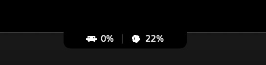
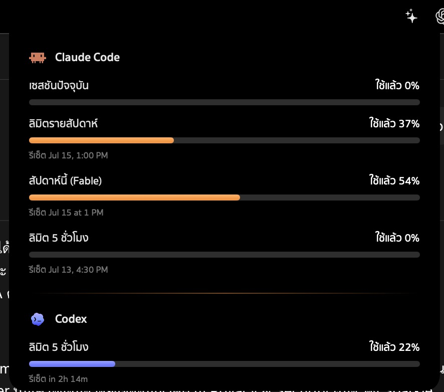
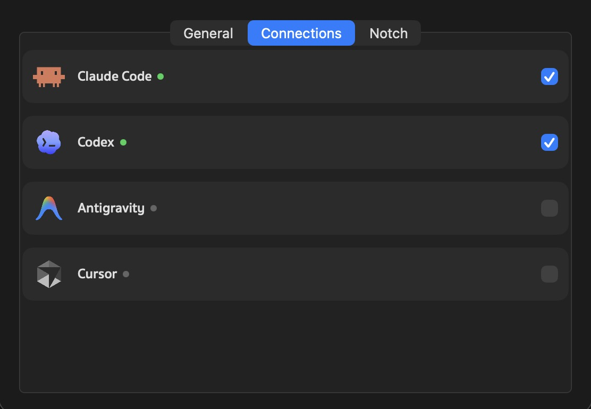

# AI Limit Notch

A compact, native macOS Notch overlay for monitoring AI coding-provider limits. The mini view shows provider logos and live 5-hour usage percentages; click it to expand into the available 5-hour and weekly limits.

## Preview

### Mini Notch



### Expanded limits



### Provider settings



## Features

- Native SwiftUI and AppKit interface for macOS 13+
- 20 px mini Notch with support for 1–3 providers
- Expandable provider-limit dashboard
- Claude Code and Codex support
- Provider enable/disable controls and custom display order
- Color and Black & White appearance modes
- Thai and English language settings
- Collapse automatically when clicking outside the Notch
- Launch at Login using `SMAppService`
- OTA update support through Sparkle and GitHub Releases

## Providers

| Provider | Status | Data source |
| --- | --- | --- |
| Claude Code | Supported | Claude Code `statusLine` JSON cache |
| Codex | Supported | Latest local Codex session rate-limit cache |
| Antigravity | Planned | Collector prepared |
| Cursor | Planned | Collector prepared |

Codex data is read locally from `~/.codex/sessions` and refreshed every 20 seconds.

The expanded view also shows each provider's server status, derived from the official status feeds and refreshed every 5 minutes:

```text
Claude Code  https://status.claude.com/history.rss
Codex        https://status.openai.com/feed.rss
```

Claude Code reads the official `rate_limits.five_hour` and `rate_limits.seven_day` values from:

```text
~/Library/Application Support/AILimitNotch/claude-usage.json
```

The configured Claude Code status-line command should copy the JSON it receives on standard input to this file. No OAuth token is copied or exported.

## Requirements

- macOS 13 Ventura or later
- Swift 5.10 or later for development
- Claude Code and/or Codex installed for live provider data

## Development

Clone and run the project:

```bash
git clone https://github.com/sb4yd3e/Mac-Notch-AI-Limit-widget.git
cd Mac-Notch-AI-Limit-widget
swift run
```

Build without launching:

```bash
swift build
```

The development executable is not a distributable macOS app bundle. Launch at Login and self-updates become available after packaging, signing, and installing the project as an `.app`.

## Settings

Open Settings from the sparkle icon in the macOS menu bar or press `⌘,`.

- **General:** language, Launch at Login, and update preferences
- **Connections:** enable providers and inspect connection status
- **Notch:** appearance, mini-item count, and provider order

## Updates and Releases

The app uses [Sparkle](https://sparkle-project.org/) and expects its appcast at:

```text
https://github.com/sb4yd3e/Mac-Notch-AI-Limit-widget/releases/latest/download/appcast.xml
```

Each GitHub Release must include a signed application archive and `appcast.xml`. See [RELEASING.md](RELEASING.md) for the release checklist.

## Privacy

Usage information is read from local Claude Code and Codex files. The app does not upload provider credentials or usage data.

## License

AI Limit Notch is available under the [MIT License](LICENSE).
